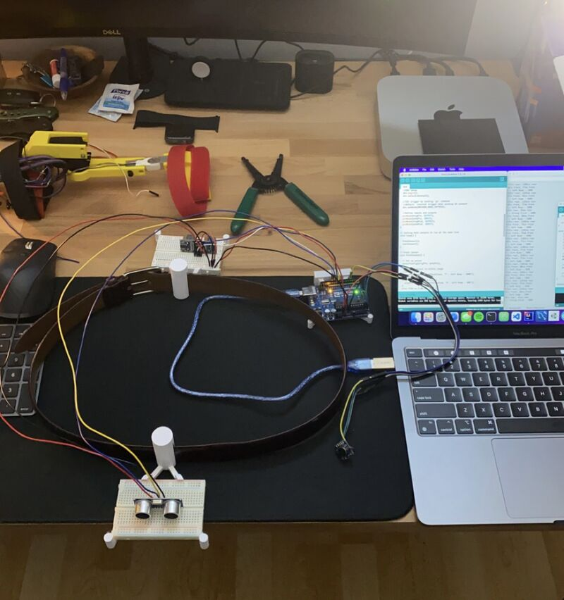

# Spideybelt - Arduino Physics Project

## Introduction
The code used in the project was tied to a prototype for a belt attachment which would act as a device to aid the visually impaired with obstacle detection and avoidance.

## Specifications

The belt attachment itself was made from 3d printed PLA plastic, custom designed by my brother, Eric Malani, to hold the arduino uno as well as the front and rear breadboards. 

Each breadboard consisted of an ultrasonic sensor, which was used to identify the distance from the object in front of it. These sensors coupled with a small vibrating motor with wires long enough to reach the user's wrist allowed for a solution that notified the user of the distance from an object, with different vibration patterns for front and rear.

**Products Used:** 
- 1 Arduino Uno
- 2 Arduino Breadboards
- 2 Ultrasonic Senors (HC-SR04)
- 1 Vibrating Motor

**The script is designed to give different vibration frequencies and strengths for distances between 300 and 200 cm, 200 and 100 cm, and less than 100cm.**

## Usage 
- **Step 1:** Assemble the spideybelt prototype.
- **Step 2:** Download the Arduino development environment on your device and connect the arduino to your device.
- **Step 3:** Execute the spideybelt.ino script.

## Resources 
- Complete Guide for Ultrasonic Sensor HC-SR04, created by Rui Santos, https://randomnerdtutorials.com
